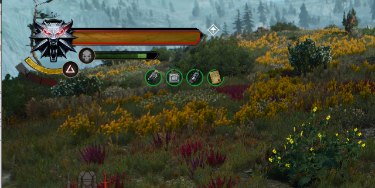

Consumables on cooldowns

# Features

Whenever you use a consumable, be it a potion, a decoction or a bomb, an effect will appear on your buff bar. This effect lasts for 15 minutes and once it is completed, you will get back 1 stack of every consumable you have unlocked. If some of your consumables are still not at full capacity the effect will start again.

Basically, every 15 minutes you get your consumables back but only one at a time. So if you happen to use four of the same bomb in an encounter, you will have to wait an hour for them to come back.

# Why

Your consumables are now almost infinite and free, but if you empty a stack at once you will have to wait for a really long time. As the 15 minutes effect gives you only one item of each type, this encourages you to vary your use of consumables during your encounters in order to maximise the effect.

In vanilla, potions are almost free considering the tiny brewing cost there is. With this mod you no longer have the extra step to get them back. You are still free to medidate to refill them as this feature was not removed.

# Compatibilty

This mod `modConsumablesOnCooldown` is compatible with any other mod you can find. It is entirely independant of all the vanilla logic and cannot break anything in the game.

# Installing
 - download the [latest version of this mod](https://github.com/Aelto/tw3-consumables-on-cooldowns/releases)
- confirm you now have a zip archive with two folders named `modConsumablesOnCooldown` and `mod_sharedutils_customcooldowns` in it
 - drop the two folders in your mods folder
 - confirm you now have a `modConsumablesOnCooldown` and a `mod_sharedutils_customcooldowns` folder  in your mods folder
 - open the script merger of your choice and start merging. Few unresolved conflicts should appear as i kept them to the minimum, everything should auto-merge
 - load a save, drink a potion and confirm the effect appeared on your buff bar. The effect has a scroll icon.
